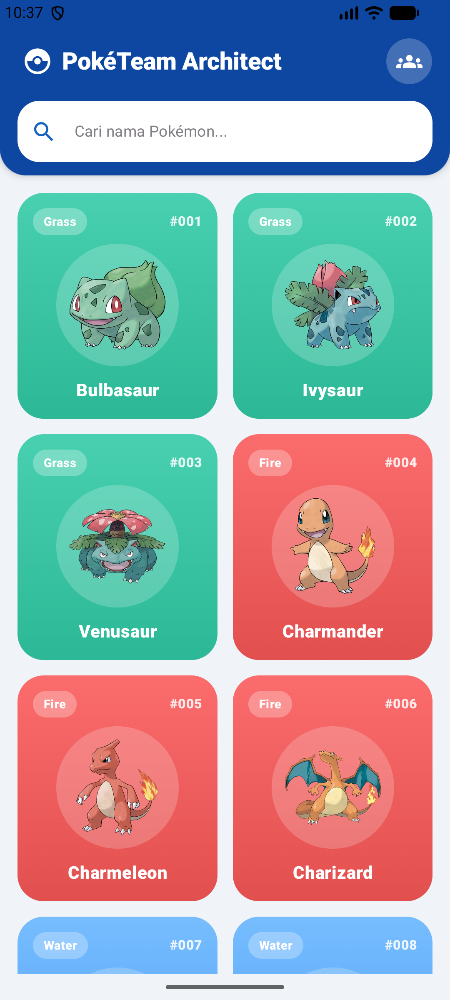
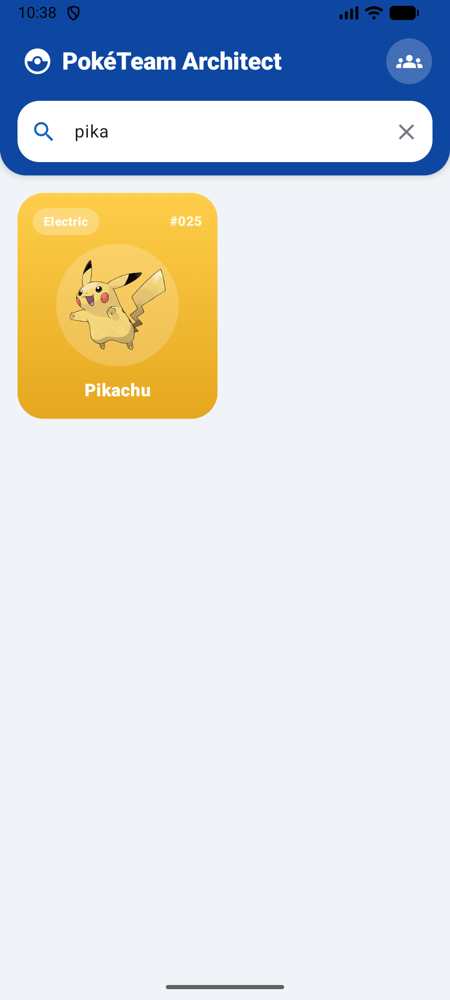
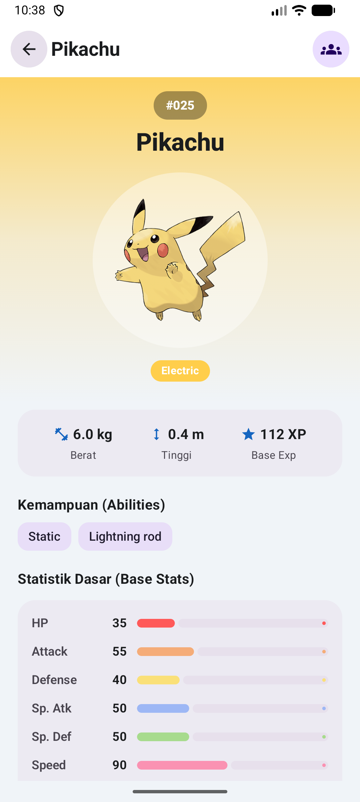
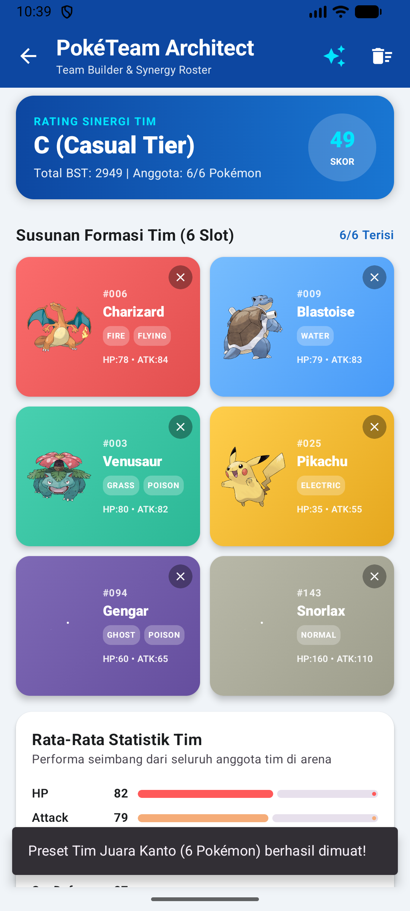
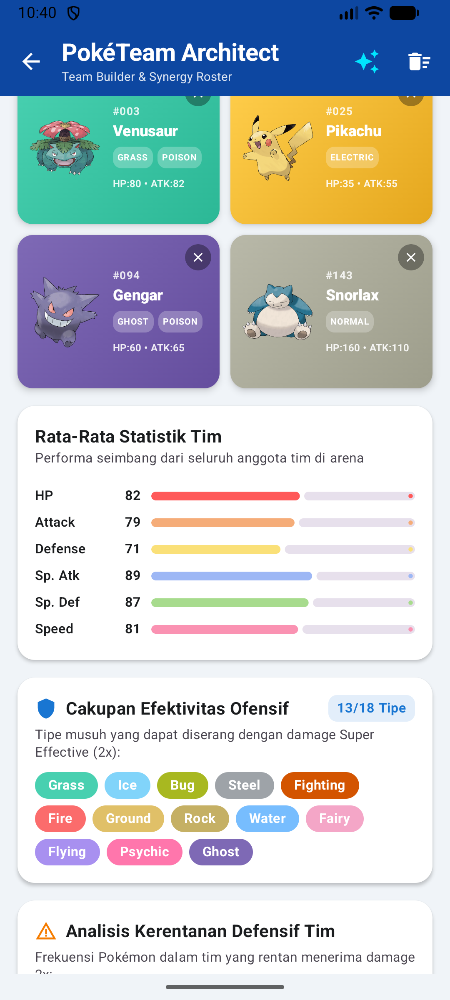

<div align="center">


# PokéTeam Architect: Catalog & Synergy Roster
> Aplikasi Mobile Android Modern untuk Katalogisasi Pokémon, Eksplorasi Atribut, dan Formasi Tim Sinergi 6 Slot berbasis Jetpack Compose Material 3, PokéAPI REST, dan Arsitektur MVVM.

[](https://developer.android.com)
[](https://kotlinlang.org)
[](https://developer.android.com/jetpack/compose)

[](https://pokeapi.co)
[](https://square.github.io/retrofit/)
[](https://developer.android.com/topic/architecture)
[](LICENSE)

</div>

## 👤 Identitas Praktikan
- **Nama Lengkap:** MUHAMMAD NAJMI ZAHRIAN
- **NIM:** H1D024038
- **Program Studi:** S1 Teknik Informatika
- **Fakultas:** Teknik
- **Instansi:** Universitas Jenderal Soedirman (UNSOED)
- **Paket Aplikasi (Package Name):** `com.najmizahrian.pokedex`

---

## 🎥 Video Penjelasan
▶️ **[Tonton Video Penjelasan Proyek di YouTube](https://youtu.be/_IIEvczepL4?feature=shared)**

---

## 📱 Deskripsi Aplikasi
**PokéTeam Architect** adalah aplikasi mobile Android berstandar industri yang dirancang untuk memfasilitasi pencarian, katalogisasi, serta **pembentukan formasi tim Pokémon kompetitif (Party of 6)** secara dinamis langsung dari [PokéAPI](https://pokeapi.co/).

Aplikasi ini mengusung tema eksklusif **Deep Cobalt Blue & Electric Cyan** yang modern dan elegan. Selain menyajikan detail atribut fisik, tipe elemen, dan statistik dasar setiap Pokémon secara komprehensif, fitur unggulan aplikasi ini memungkinkan pengguna menyusun 6 Pokémon pilihan ke dalam satu formasi tim, lalu secara otomatis menganalisis:
1. **Performa Statistik Gabungan:** Total Base Stats (BST) dan visualisasi rata-rata HP, Attack, Defense, Sp. Atk, Sp. Def, dan Speed.
2. **Cakupan Efektivitas Ofensif:** Menghitung berapa banyak dari 18 tipe Pokémon yang dapat diserang dengan damage *Super Effective* (2x).
3. **Analisis Kerentanan Defensif Tim:** Mengidentifikasi kelemahan bersama antar anggota tim serta memberikan peringatan dini jika terdapat tipe musuh yang dapat mengeksploitasi pertahanan tim.
4. **Rating Sinergi Tim:** Algoritma penilaian cerdas (Skor 0-100 dan Tier Peringkat S/A/B/C) untuk mengukur keseimbangan tim.

---

## 🛠️ Penjelasan Teknis

### 1. Spesifikasi & Tech Stack
- **Bahasa Pemrograman:** Kotlin 2.0.21
- **UI Framework:** Jetpack Compose (Material Design 3)
- **Min SDK:** 29 (Android 10.0) | **Target SDK:** 36 (Android 16)
- **Pola Arsitektur:** MVVM (Model-View-ViewModel) murni
- **Library Utama:**
  - `Navigation Compose` (`androidx.navigation:navigation-compose:2.8.5`): Pengelolaan perpindahan antar layar (Home, Detail, Team Builder) secara type-safe.
  - `ViewModel` & `StateFlow` (`androidx.lifecycle:lifecycle-viewmodel-compose:2.8.7`): State management reaktif yang decoupled dari UI Composable.
  - `Retrofit 2` & `Gson Converter` (`com.squareup.retrofit2:2.11.0`): Komunikasi jaringan HTTP ke PokéAPI REST service.
  - `OkHttp Logging Interceptor` (`com.squareup.okhttp3:4.12.0`): Logging request & response jaringan untuk pemantauan API.
  - `Coil Compose` (`io.coil-kt:coil-compose:2.7.0`): Pemuatan official artwork Pokémon secara asinkron dengan caching memori dan transisi crossfade.
  - `Kotlin Coroutines`: Pemrosesan asinkron non-blocking di background thread (`Dispatchers.IO`).

---

### 2. Fitur Unggulan

#### A. Katalog Pokémon & Pewarnaan Adaptif (Home Screen)
- Menampilkan daftar 151 Pokémon Generasi 1 dalam format grid 2 kolom yang responsif.
- Tiap kartu Pokémon menampilkan nomor indeks resmi (`#001`), official artwork, nama Pokémon, serta **gradien latar belakang yang beradaptasi otomatis sesuai tipe elemen utama Pokémon** (Grass, Fire, Water, Electric, Poison, Dragon, dll).
- Dilengkapi pencarian real-time via `PokemonSearchBar` untuk memfilter Pokémon berdasarkan nama maupun ID.

#### B. Eksplorasi Detail Pokémon Komprehensif (Detail Screen)
- Header gradien adaptif berukuran dinamis dengan gambar artwork resolusi tinggi.
- Tombol navigasi kembali (*Back Button*) elevated yang kontras.
- Menampilkan data metrik fisik (tinggi dalam meter, berat dalam kg), base experience, daftar kemampuan (*abilities*), serta visualisasi bar statistik dasar (HP, ATK, DEF, SP.ATK, SP.DEF, SPD).
- Tombol navigasi langsung ke fitur formasi tim sinergi (*PokéTeam Architect*).

#### C. Fitur Unik: PokéTeam Architect & Synergy Roster (Team Screen)
- **6-Slot Party Formation:** Mengelola 6 slot anggota tim. Slot kosong dapat diklik untuk membuka modal pencarian katalog 151 Pokémon.
- **Rata-Rata Statistik Tim:** Menghitung total BST dan bar rata-rata statistik untuk membandingkan performa fisik vs spesial tim.
- **Offensive Coverage Radar:** Menganalisis cakupan elemen tim terhadap 18 tipe Pokémon lawan dengan indikator badge warna-warni.
- **Defensive Vulnerability Alert:** Mendeteksi kerentanan ganda; memberikan alert bertanda khusus jika 3 atau lebih Pokémon dalam tim rentan terhadap serangan tipe yang sama.
- **Tombol Preset Tim Cepat:** Menyediakan tombol 1-klik untuk memuat formasi Juara Kanto (*Charizard, Blastoise, Venusaur, Pikachu, Gengar, Snorlax*) untuk keperluan demo instan.
- **Tombol Reset Tim:** Fitur pengosongan formasi secara instan dengan feedback snackbar interaktif.

---

### 3. Struktur Direktori Proyek

```text
app/src/main/java/com/najmizahrian/pokedex/
├── data/
│   ├── model/
│   │   ├── PokemonDetailResponse.kt    # DTO Response detail & stats dari PokéAPI
│   │   ├── PokemonListResponse.kt      # DTO Response daftar nama & endpoint Pokémon
│   │   ├── PokemonTypeHelper.kt        # Pemetaan tipe atribut Pokémon Kanto 1-151
│   │   ├── PokemonUiModel.kt           # Model siap pakai untuk UI (PokemonItem, PokemonDetail, StatItem)
│   │   └── TypeChartHelper.kt          # Algoritma sinergi elemen, efektivitas tipe, & kalkulasi skor tim
│   ├── remote/
│   │   ├── PokeApiService.kt           # Definisi interface Retrofit (@GET pokemon & @GET pokemon/{id})
│   │   └── RetrofitClient.kt           # Singleton konfigurasi Retrofit, OkHttpClient, & Base URL
│   └── repository/
│       └── PokemonRepository.kt        # Repository layer: orkestrasi data & mapping ke UI Model
├── ui/
│   ├── components/
│   │   ├── PokemonCard.kt              # Card Composable adaptif sesuai atribut tipe Pokémon
│   │   ├── PokemonSearchBar.kt         # Search bar dengan ikon pencarian Cobalt Blue
│   │   ├── StatBar.kt                  # Horizontal animated progress bar untuk Base Stats
│   │   ├── StateComponents.kt          # Komponen LoadingView, ErrorView (Retry), dan EmptyView
│   │   └── TypeBadge.kt                # Chip badge warna-warni sesuai tipe elemen (Fire, Water, Grass, dll)
│   ├── navigation/
│   │   ├── NavGraph.kt                 # NavHost menghubungkan HomeScreen, DetailScreen, & TeamScreen
│   │   └── Screen.kt                   # Sealed class rute navigasi aplikasi
│   ├── screens/
│   │   ├── home/
│   │   │   ├── HomeScreen.kt           # Layar katalog utama dan filter pencarian real-time
│   │   │   └── HomeViewModel.kt        # Pengelolaan StateFlow dan filter pencarian katalog
│   │   ├── detail/
│   │   │   ├── DetailScreen.kt         # Layar detail atribut, fisik, tipe, dan statistik + tombol back
│   │   │   └── DetailViewModel.kt      # Pengelolaan StateFlow detail Pokémon spesifik
│   │   └── team/
│   │       ├── TeamScreen.kt           # Layar formasi 6 slot tim, analitik statistik, & radar sinergi
│   │       └── TeamViewModel.kt        # Pengelolaan StateFlow formasi tim, cakupan tipe, & rating sinergi
│   └── theme/
│       ├── Color.kt                    # Definisi palet warna Deep Cobalt, Electric Cyan, tipe elemen, & stats
│       ├── Theme.kt                    # Konfigurasi Dark / Light PokeTeamTheme Material 3
│       └── Type.kt                     # Typography Material 3
└── MainActivity.kt                     # Entry point Android Activity yang merender PokemonNavGraph
```

---

## 📸 Tangkapan Layar Aplikasi (Screenshots)

<div align="center">

| 1. Katalog & Grid | 2. Pencarian Real-Time | 3. Detail & Base Stats |
|:---:|:---:|:---:|
|  |  |  |

| 4. Formasi 6 Slot Tim (Party Roster) | 5. Analisis Sinergi & Cakupan Efektivitas |
|:---:|:---:|
|  |  |

</div>

---

## 📬 Pengujian API (Postman Collection)
Koleksi Postman resmi disertakan pada akar proyek:
- Berkas: `PokeDex_API_Postman_Collection.json`
- Mendukung pengujian:
  1. `GET List 151 Pokémon`: Verifikasi pagination limit/offset katalog.
  2. `GET Detail Charizard (#006)`: Validasi penyerang Fire/Flying Slot #1.
  3. `GET Detail Pikachu (#025)`: Validasi tipe Electric sweeper.
  4. `GET Detail Blastoise (#009)`: Validasi tank Water pertahanan tim.

---

## 🚀 Cara Menjalankan Proyek

1. **Prasyarat:**
   - Android Studio (versi Ladybug / Koala / Hedgehog atau lebih baru disarankan).
   - JDK 17 atau lebih baru.
   - Perangkat fisik Android dengan mode *USB Debugging* aktif atau Android Emulator (API level 29 ke atas).
   - Koneksi internet aktif untuk sinkronisasi PokéAPI pertama kali.

2. **Langkah:**
   - Buka Android Studio.
   - Pilih **Open** dan arahkan ke direktori `D:\jmizah\responsi`.
   - Tunggu proses **Gradle Sync** selesai secara otomatis.
   - Pilih target perangkat atau emulator.
   - Klik tombol **Run (`Shift + F10`)** pada toolbar Android Studio.
